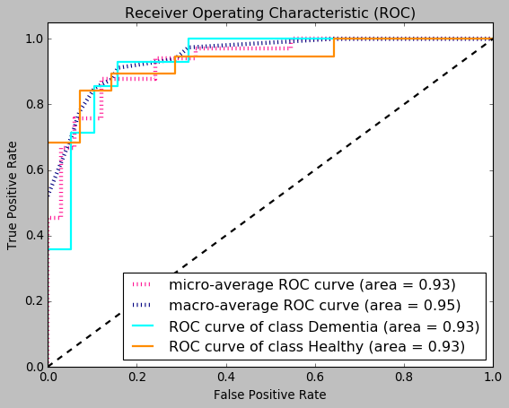
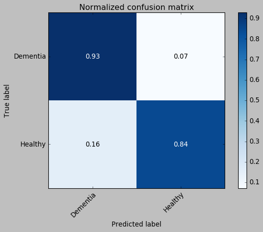
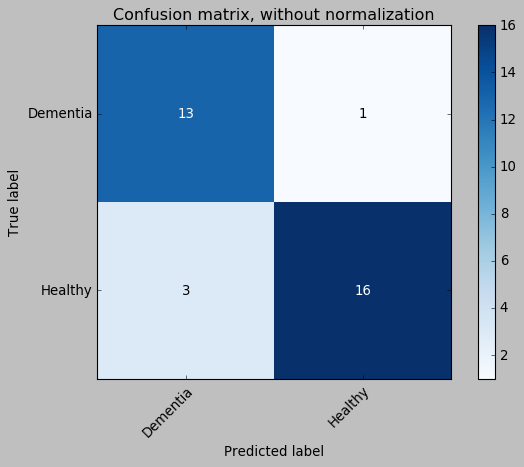

# Automated Diagnostic Toolkit for Dementia in Ageing Deaf Users of British Sign Language
## Train and evaluate CNN deep learning model (ResNet50 / VGG16) based on transfer learning for early stage dementia screening in Keras

### Methodology
To utilise OpenPose library for hand movement trajectory tracking 
- Firstly please intall Keras deep learning model following the instructions of the link: https://github.com/fchollet/deep-learning-models. 
- Then download the code to use transfer learning in keras with the example of training a 2 class classification model using VGG-16 and Resnet-50 pre-trained weights. 


## Results
- ROC Curve and Confusion Matrix
<div align="center">
  </a>
</div>
<p align="center">

</p>  


## Citations
```
@inproceedings{liang2019handtracking,
  author = {X. Liang, E. Kapetanios, B. Woll and A. Angelopoulou},
  booktitle = {Cross Domain Conference for Machine
Learning and Knowledge Extraction (CD-MAKE2019)},
  title = {Real Time Hand Movement Trajectory Tracking for Enhancing
Dementia Screening in Ageing Deaf Signers of British Sign Language},
  year = {2019}
}
```
